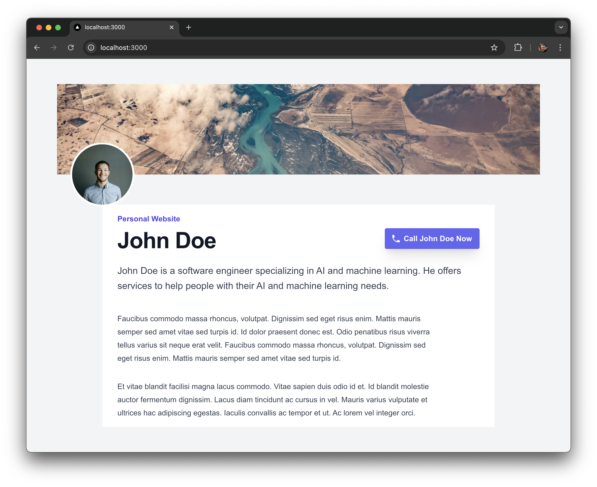
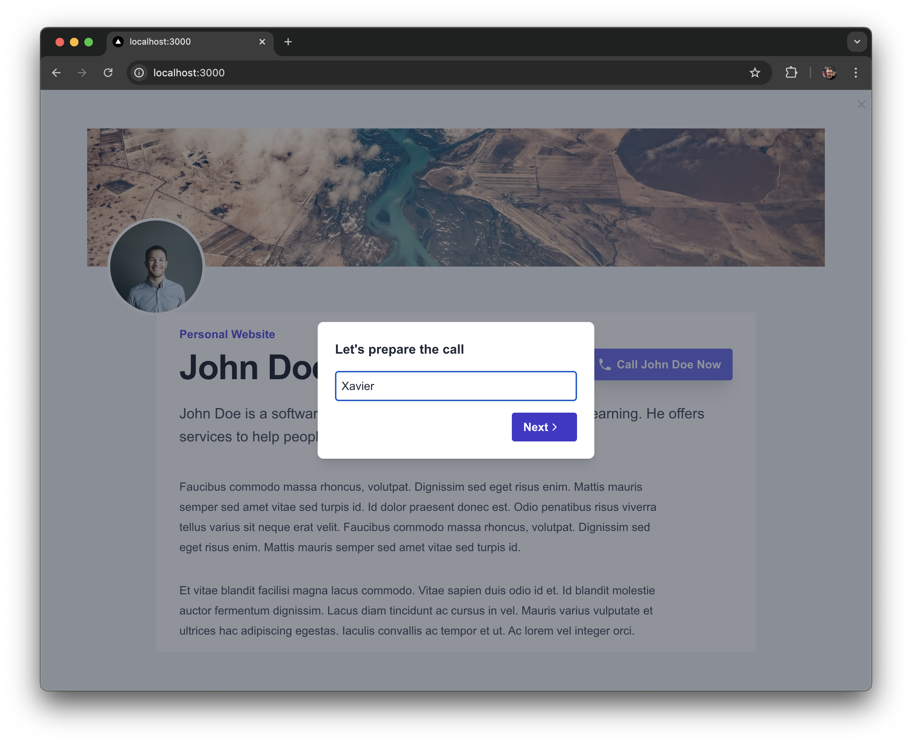

# Voxlink: Click-to-Call Web Plugin

Voxlink reinvents the voicemail in the age of AI. It's your Executive Assistant Software that takes care of the people calling you.

## What's Voxlink?

### Core Concept
Voxlink is an AI-powered voice assistant that allows users to initiate a call to a user and get assistance to leave a rich message to the user for a better experience.

### How it works
Voxlink is deployed as a web plugin in JavaScript that enables a click-to-call action on any webpage. The plugin will create an iframe that dynamically generates a user experience for initiating a call.
It's also available on a dedicated regular phone number.

### IntegrationExample with a personal website:

1. Click the "Call Me Now" button on any webpage.

2. Enter your name.

3. Select a microphone.

4. Click "Start the Call".

5. Chat with the user's voice assistant to leave a message to the user.

6. Click "Stop Call" to end the call.

## Architecture

See more details in the [architecture](./docs/architecture.md) document.
