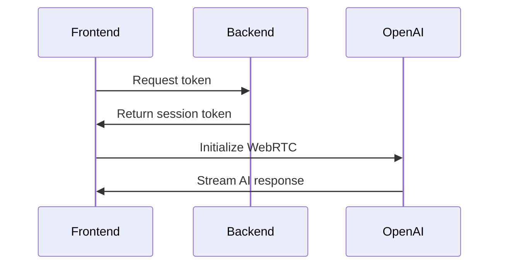

# Voxlink Architecture

## Workflow and Process:

### 1. Button Configuration:
- A configurable button with text such as "Call Me Now"
- When clicked, it opens a modal view

### 2. Modal View Steps:

#### Step 1: Initial Setup
- Shows welcome message
- User enters their name
- User can proceed to next step

#### Step 2: Microphone Access
- Request microphone permissions
- Shows microphone selection dropdown if multiple devices available
- Displays waiting message while getting permissions

#### Step 3: Call Preparation
- Shows "Calling..." screen
- Plays ringtone
- Displays "Hold on, the call is being prepared"
- Maximum ringtone duration is 10 seconds (MAX_RINGTONE_DURATION = 10000)

#### Step 4: Active Call
- Shows "Call in Progress" screen
- Displays call duration timer
- Allows user to stop the call

The steps progress sequentially (1 → 2 → 3 → 4) and can be stopped at any point by clicking outside the modal, except during active calls where explicit "End Call" action is required.

## Backend
The backend of Voxlink is built with:

- NextJS: A React framework that provides:
  - API routes
  - Server-side rendering

  - Built-in optimization

- OpenAI Integration:
  - Realtime API conversation processing via WebRTC

The backend handles:
- Token generation and validation
- Audio streaming
- AI model interactions
- Call state management

## Frontend
The frontend of Voxlink is built with:
- React 18+
- TypeScript
- TailwindCSS

Key components:
- CallButton: Configurable button component
- Modal: Dialog component for call flow
- AudioHandler: Manages audio streaming

The frontend handles:
- UI state management
- Audio capture and streaming
- WebRTC communication

## API Routes

1. **Core Endpoints**
   - /api/token - Generate session tokens
   - /api/hello - Health check endpoint

2. **User Management**
   - /api/user - Handle user data and preferences

## Types

1. **API Types**
   - TokenResponse - Session token response
   - ApiError - Standard error format

2. **User Types**
   - User - User profile and settings
   - UserPreferences - User configuration

## Communication Flow

