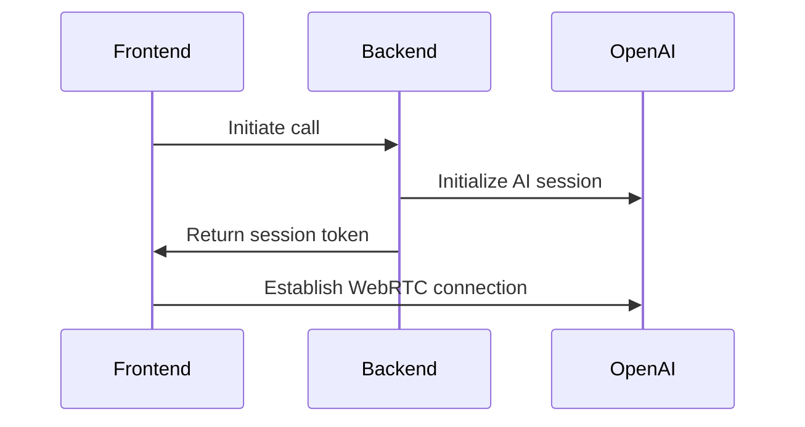
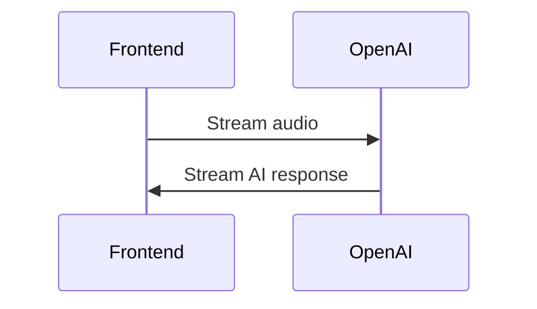

# Voxlink Architecture

## Backend Architecture

### API Routes (/backend/pages/api/)

1. **Call Management**
   - /api/call/initiate - Start a new call session
   - /api/call/stream - Handle WebRTC streaming
   - /api/call/end - End call and cleanup

2. **Authentication**
   - /api/auth/session - Manage user sessions

3. **Feedback**
   - /api/feedback/submit - Handle user feedback
   - /api/feedback/analytics - Feedback analytics

### Page Routes (/backend/pages/app/)

1. **Public Pages**
   - / - Landing page
   - /demo - Demo page
   - /pricing - Pricing information

2. **Dashboard Pages**
   - /dashboard - Main dashboard
   - /dashboard/calls - Call history
   - /dashboard/settings - User settings

### Services

1. **Call Service**
   - WebRTC connection management
   - Audio streaming
   - Call state management

2. **AI Service**
   - OpenAI integration
   - Speech-to-text processing
   - Natural language understanding

## Frontend Architecture

### Components

1. **Core Components**
   - Button - Reusable button component
   - Modal - Modal dialog component
   - VoiceChat - Main voice chat interface

2. **Feature Components**
   - CallInitiator - Handles call initialization
   - MicrophoneSetup - Microphone configuration
   - FeedbackForm - User feedback collection

### State Management

1. **Context Providers**
   - CallContext - Manages call state
   - AudioContext - Handles audio configuration

2. **Custom Hooks**
   - useAudio - Audio stream management
   - useWebRTC - WebRTC connection handling
   - useCallState - Call state management

## Communication Flow

1. **Call Initiation**

2. **Voice Processing**

