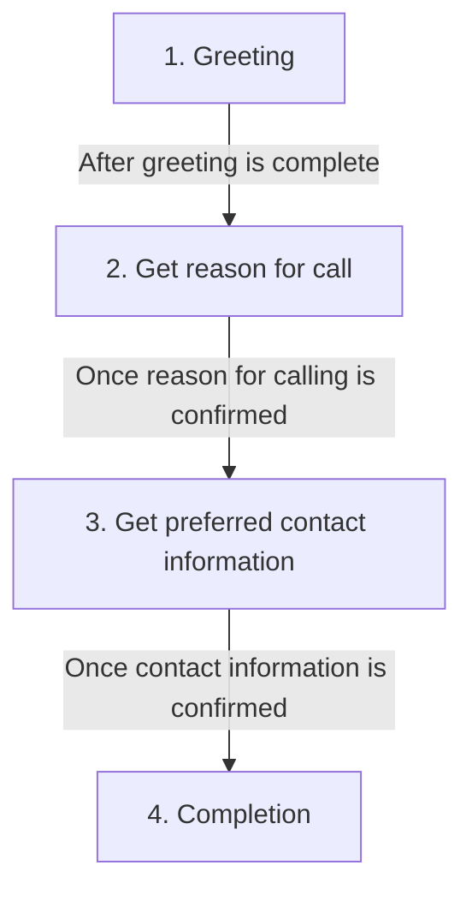

# Conversation flow

## Details

1. **Greeting**
   - Greet the caller warmly
   - Explain that the user is unavailable
   - Introduce self as executive assistant

2. **Get reason for call**
   - Ask for reason for calling
   - Use `show_details_reason` function to confirm

3. **Get preferred contact information**
   - Request phone number or email
   - Use `show_details_email` or `show_details_phone` function to confirm

4. **Completion**
   - Thank the caller
   - Inform that the user will be notified
   - Close the call

See `lib/config.ts` for more details.